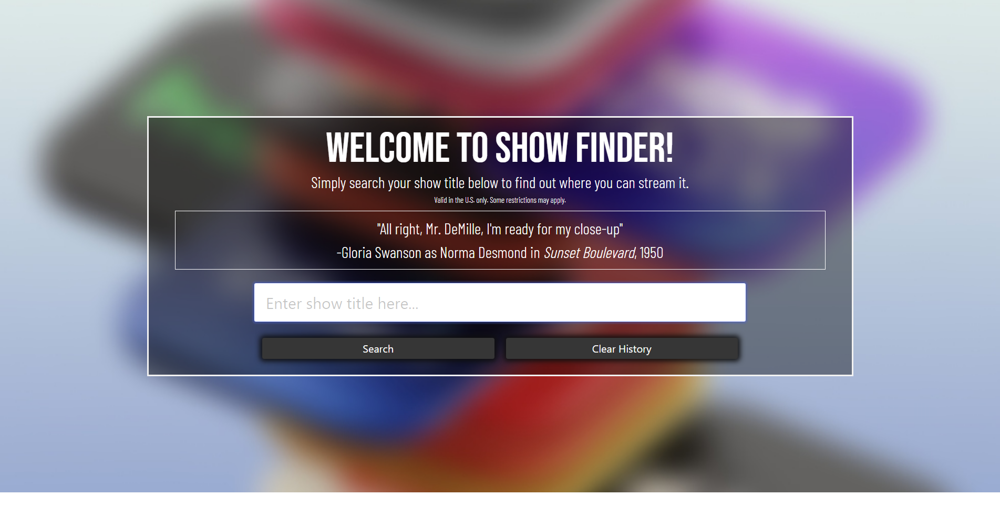

# Show-Finder

## Description 

Show Finder will display the TV show title, a picture of the show, and the streaming services’ logo where the show is available. All that you need to do is type in your desired show title and hit search. When you click on a logo, the site will direct you to your show on the chosen site. Logo icons linked to websites with more information on the show are also available. Show Finder will also create a search history, so you can refer to the streaming location of titles you have searched before. There is also a movie quote on the homepage that changes with every refresh. 

## Technologies Used

- HTML
- CSS
- JavaScript
- Bulma CSS Framework
- Utelly API: gets information from services like Netflix, Amazon Prime Video, iTunes, Apple TV+, etc.
- MQ API: query for Famous Movie and TV show quotes
- Slack & Zoom for communications

## Directions for Future Development

- Upgrade Utelly API from the Basic plan to the Pro plan to pull from more streaming services
- Add pricing for each streaming service
- Display more than one version of a show in the search results
- Add season number as a parameter

## Screenshot

## Deployed Application Link: 
https://srandall1213.github.io/Show-Finder/

